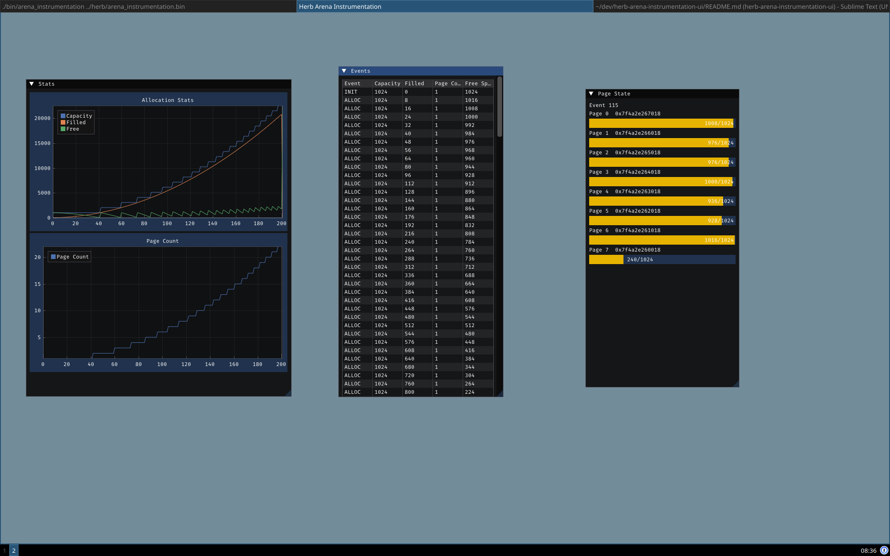

# Herb Arena Instrumentation UI

This projects allows you to visualize the output of the herb arena instrumentation system

## Building

### Prerequisites

- Install sdl3 via a package manager
- Have pkg-config installed

### Cloning

Clone the repository and initialize all submodules

```sh
$ git clone git@github.com:timkaechele/herb-arena-instrumentation-ui.git
$ git submodule init
$ git submodule update --recursive
```

### Building the project

```sh
$ bash build_deps.sh
$ bash build.sh
```

## Running the project

Start the project by running

```sh
./bin/arena_instrumentation $PATH_TO_INSTRUMENTATION_BIN
```

## Screenshots



